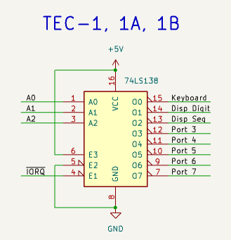
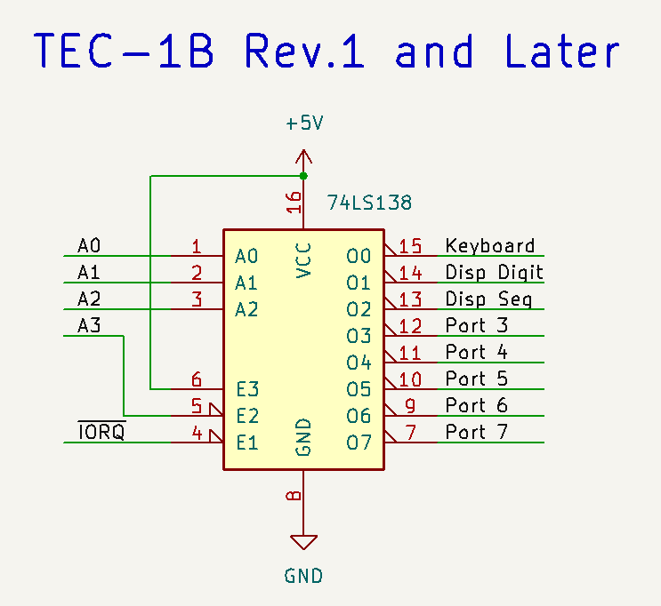
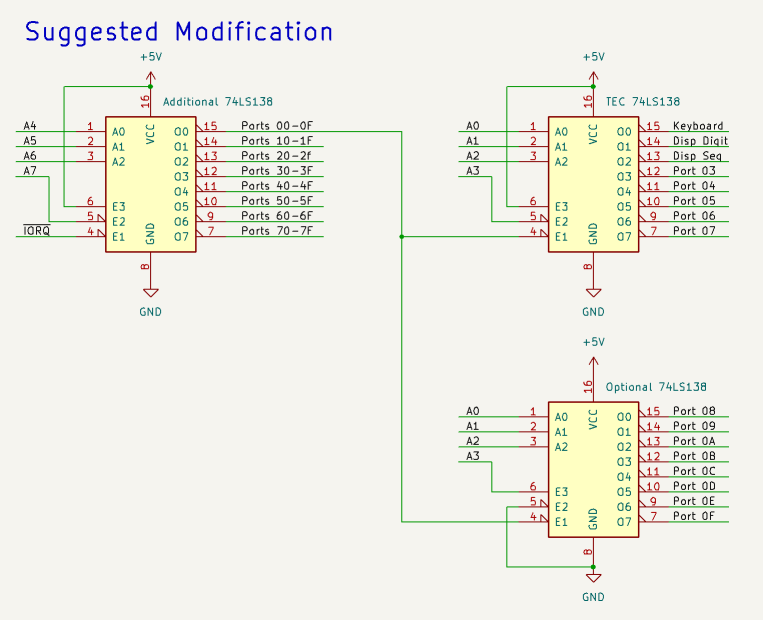

<h1>TEC-1 I/O Ports Definitions</h1>

## For the standard TEC-1x family hardware (TEC-1/1A/B/C/D/F) as per TE issues 10-15:

If we define 'standard' monitors, as the MON 1 family & MON 2, then ports 0-2 are defined.
With the DAT board (and JMON), ports 3, 4 & 84h are additonally defined.

NB: Many TEC add ons used various ports (3 & 4 mostly) but the code can normally be changed easily to support any port available in hardware as the MONitors don't touch these ports in any way.

#### Port 0 - Keyboard data input:
 - bits 0-4 -- keypressed value from the 74c923
 - bit 5 - low = Shift pressed (Used by Mon2 +)
 - bit 6 - low = Key pressed - used only by JMON with 4k7 resistor mod or DAT board
 - bit 7 - not connected

#### Port 1 - 7-seg Display select & speaker (& JMON tape out) output
 - bits 5-0 select seach 7-segment display, bit 5 = left, bit 0 = right
 - bit  6 - not connected
 - bit  7 - speaker output & tape output (tape --- JMON with DAT board only)

#### Port 2 - 7-seg segment select output
 - bit 0	segment a
 - bit 1	segment f
 - bit 2	segment g
 - bit 3	segment b
 - bit 4	decimal point
 - bit 5	segment c
 - bit 6	segment e
 - bit 7	segment d

Segments are defined as per the FND-500 7-segment display specification.

#### Port 3 - MON1/1A/2 - uncommitted
#### Port 3 - JMON - DAT board serial/inputs/keypresss sense/tape input (JMON only)
 - bit 0	serial input 
 - bit 1	IN port 1 
 - bit 2	IN port 2 
 - bit 3	IN port 3 
 - bit 4	IN port 4 
 - bit 5	IN port 5 
 - bit 6	Keypress sense - LOW = a 74c923 key is being pressed 
 - bit 7	Casette input 

#### Port 4 - MON1/1A/2 - uncommitted
#### Port 4 - JMON - DAT board LCD control port output (JMON only)

	As per the HD44780 16x2 LCD Spec - Instruction Register

(Most of the software written for the 8x8 assumes it is on Port 3 & 4)

#### Ports 5/6/7 - uncommitted
(With the DAT / LCD boards taking up ports 3 & 4, any software written for the 8x8 should aim for using Ports 5 & 6)

#### Port 84h - JMON DAT board LCD data port input/output (JMON only)

	As per the HD44780 16x2 LCD Spec - Data Register

In JMON, the LCD picks up A7 as the 'register select' line, hence the port 04h/84h mapping.

## TEC-1 I/O Address Space & Expansion

In a standard TEC only 8 I/O ports are decoded, so the I/O space 'wraps' every 8 ports. Adding A3 to pin 5 of the 74LS138 (disconnect pin 5 from GND and connect to A3 instead) expands this to 16 ports. This mod is done on TEC-1B rev.1 and later PCBs.

 &nbsp;&nbsp;&nbsp;&nbsp; 

To decode ports 8-15, add another 74LS138, wired exactly as per the existing, except connect A3 to pin 6 instead of +5v & Keep pin 5 Grounded).

For >16 ports, A4 could also be used to decode up to 32 ports. Connect A4 to pin 6 via an inverter to the first two 74ls138's, add two more 74ls138's and connect A4 directly (not inverted) to the second two '138's on pin 6 also. (Disconnect pin 6 from +5v on all 4 chips). A spare gate on the 4049 could serve as the inverter without adding additional chips.

A more universal design is presented below; it simply needs 1 more 74ls138 chip. The following design fully decodes the entire IO address space, meaning no port overlaps -- allowing use of SC-1 peripherals at port 80h+ whist keeping almost full original hardware compatibility. Additional IO port selects can be created by simply adding more 74ls138's and wiring them to the relevant select outout of the additional '138 shown.

This will break LCD support in JMON however, due to the LCD using ports 04h and 84h. To avoid this, don't connect to A7 and instead just ground pin 5 of the additional '138. This will cause the IO ports to wrap around on the high bit. I.e Port 00h wraps to 80h, 01h/81h etc. 

## For Southern Cross SC-1

The 74HC138 decodes address lines A7 (high), A6 (low) and A0-2 (port select). This means it occupies the IO address range 80h to BFh, wrapping around every 8 ports within this space.

#### Ports 80h to 83h - uncommitted - available on the I/O port expansion connector

ROM Routine Fn + E assumes there are two 8x8 display modules connected at ports 80h-81h and 82h-83h and displays a scrolling message on the 8x8 displays.
ROM routine Fn + D assumes there is an 8 port relay board on port 81h; it cycles the relays on and off in a testing pattern.

#### Port 84h - 7-seg Segment select output
 - bit 0	segment g
 - bit 1	segment f
 - bit 2	segment c
 - bit 3	segment d
 - bit 4	segment e
 - bit 5	decimal point
 - bit 6	segment b
 - bit 7	segment a

Note that the segment order is different in the SC-1 vs. the TEC. Any Lookup tables can be re-written easily to adapt one design to the other.

#### Port 85h - 7-seg Digit select, Data and Speaker outputs
 - bits 5-0 select seach 7-segment display, bit 5 = left, bit 0 = right
 - bit  6 - Data out - Serial transmit
 - bit  7 - speaker output

#### Port 86h - Keyboard buffer data input
 - bits 0-4 -- keypressed value from the 74c923
 - bit 5 - high = Key pressed - read from the 74c923
 - bit 6 - Data IN2 - bitbang serial receive
 - bit 7 - Data IN1

#### Port 87h - Optional single-stepper hardware

 - writing any value or reading from this port toggles the advanced single-stepper hardware [if built per the SC-1 manual] on and off.

### A word from Craig Jones, Designer of the SC-1

"The SC-1 uses ports 80 to 83 in the "I/O" port at the top of the board. The I/O port uses a 16 pin IDC to connect to the relay board or up to 2 8x8 displays. I didn't conceive of needing any more than 16 I/O ports so I used A6 and A7 one active low and one active high. This way just by connecting them the other way around I get the other 8 ports. I use port 87 to enable/disable the single stepper."

Note that the SC-1 has the keyboard and 7-segment ports in a different order compared to the TEC.

The SC-1 decodes Address lines A6 and A7 for I/O meaning it has the ability to expand to 32 I/O ports - ranges 40h-4Fh and 80h to 8Fh. The onboard 74HC138 decodes 80h to 87h.

Note the SC-1's address model conflicts with the DAT board's use of 84h, meaning you can't fit a TEC/JMON type LCD to the SC-1 and use JMON in it without additional code rewrites. To fix this, use a different address line instead of A7 - e.g. use of A6 on the DAT board would put the LCD at 04h/44h.
